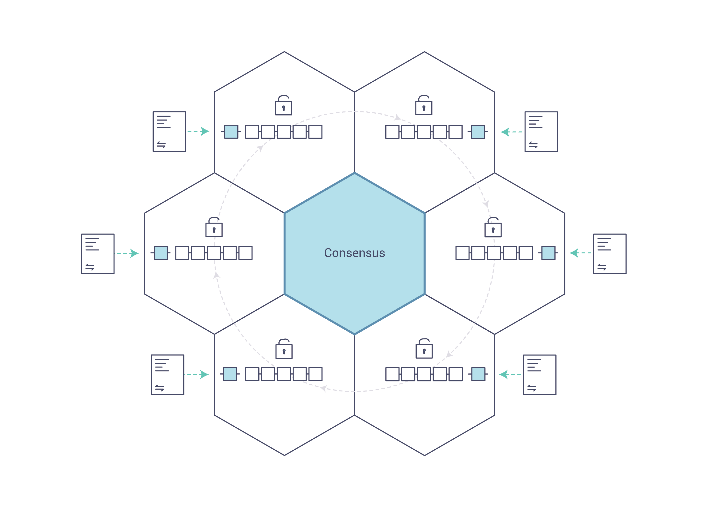

Introduction
============
Hyperledger Fabric is a platform for distributed ledger solutions underpinned
by a modular architecture delivering high degrees of confidentiality,
resiliency, flexibility and scalability. It is designed to support pluggable
implementations of different components and accommodate the complexity and
intricacies that exist across the economic ecosystem.

Hyperledger Fabric delivers a uniquely elastic and extensible architecture, distinguishing
it from alternative blockchain solutions. Planning for the future of enterprise
blockchain requires building on top of a fully vetted, open-source architecture;
Hyperledger Fabric is your starting point.

We recommended first-time users begin by going through the rest of the
introduction below in order to gain familiarity with how blockchains work
and with the specific features and components of Hyperledger Fabric.

Once comfortable -- or if you're already familiar with blockchain and
Hyperledger Fabric -- go to :doc:`getting_started` and from there explore the
demos, technical specifications, APIs, etc.

What is a Blockchain?
---------------------
**A Distributed Ledger**

At the heart of a blockchain network is a distributed ledger that records all
the transactions that take place on the network.

A blockchain ledger is often described as **decentralized** because it is replicated
across many network participants, each of whom **collaborate** in its maintenance.
We’ll see that decentralization and collaboration are powerful attributes that
mirror the way businesses exchange goods and services in the real world.

.. note:: 区块链账本是去中心化的，每个参与方互相协作的同时都有自己的一份账本，自己维护。
          这和真实世界中的商业行为非常相似。

.. image:: images/basic_network.png

In addition to being decentralized and collaborative, the information recorded
to a blockchain is append-only, using cryptographic techniques that guarantee
that once a transaction has been added
to the ledger it cannot be modified. This property of immutability makes it
simple to determine the provenance of information because participants can be
sure information has not been changed after the fact. It’s why blockchains
are sometimes described as **systems of proof**.

.. note:: 区块链通过只能追加的设计，并利用加密技术，保证数据写入后无法篡改，
          从而能很简单地验证 **信息来源**。

 **Smart Contracts**

To support the consistent update of information – and to enable a whole host of
ledger functions (transacting, querying, etc) – a blockchain network uses **smart
contracts** to provide controlled access to the ledger.

.. note:: 通过 **智能合约** 操作账本

.. image:: images/Smart_Contract.png

Smart contracts are not only a key mechanism for encapsulating information
and keeping it simple across the network, they can also be written to allow
participants to execute certain aspects of transactions automatically.

A smart contract can, for example, be written to stipulate the cost of shipping
an item that changes depending on when it arrives. With the terms agreed to
by both parties and written to the ledger, the appropriate funds change hands
automatically when the item is received.

.. note:: 智能合约不仅为操作账本数据提供便利，还可以被设计为自动执行，取代人工
          对账等过程。但是智能合约的设计，要相当谨慎。最近公链上合约，爆出了不少
          设计缺陷与漏洞。或许未来会有一个新的职业：合约工程师。

**Consensus**

The process of keeping the ledger transactions synchronized across the network –
to ensure that ledgers only update when transactions are approved by the appropriate
participants, and that when ledgers do update, they update with the
same transactions in the same order – is called **consensus**.

.. note:: 这里的共识特指只有得到足够支持的“交易”才能入账，所有的交易都要按照同样顺序
          被记录到每个独立的账本中。在Fabric中，“交易”就是写入操作。

We’ll learn a lot more about ledgers, smart contracts and consensus later. For
now, it’s enough to think of a blockchain as a shared, replicated transaction
system which is updated via smart contracts and kept consistently
synchronized through a collaborative process called consensus.

.. note:: 一个多备份、通过智能合约操作的系统，备份严格一致。

Why is a Blockchain useful?
---------------------------

**Today’s Systems of Record**

The transactional networks of today are little more than slightly updated
versions of networks that have existed since business records have been kept.
The members of a **Business Network** transact with each other, but they maintain
separate records of their transactions. And the things they’re transacting –
whether it’s Flemish tapestries in the 16th century or the securities of today
– must have their provenance established each time they’re sold to ensure that
the business selling an item possesses a chain of title verifying their
ownership of it.

What you’re left with is a business network that looks like this:

.. image:: images/current_network.png

Modern technology has taken this process from stone tablets and paper folders
to hard drives and cloud platforms, but the underlying structure is the same.
Unified systems for managing the identity of network participants do not exist,
establishing provenance is so laborious it takes days to clear securities
transactions (the world volume of which is numbered in the many trillions of
dollars), contracts must be signed and executed manually, and every database in
the system contains unique information and therefore represents a single point
of failure.

It’s impossible with today’s fractured approach to information and
process sharing to build a system of record that spans a business network, even
though the needs of visibility and trust are clear.

**The Blockchain Difference**

What if instead of the rat’s nest of inefficiencies represented by the “modern”
system of transactions, business networks had standard methods for establishing
identity on the network, executing transactions, and storing data? What
if establishing the provenance of an asset could be determined by looking
through a list of transactions that, once written, cannot be changed, and can
therefore be trusted?

That business network would look more like this:

.. image:: images/future_net.png

This is a blockchain network. Every participant in it has their own replicated
copy of the ledger. In addition to ledger information being shared, the processes
which update the ledger are also shared. Unlike today’s systems, where a
participant’s **private** programs are used to update their **private** ledgers,
a blockchain system has **shared** programs to update **shared** ledgers.

With the ability to coordinate their business network through a shared ledger,
blockchain networks can reduce the time, cost, and risk associated with private information and
processing while improving trust and visibility.

You now know what blockchain is and why it’s useful. There are a lot of other
details that are important, but they all relate to these fundamental ideas of
the sharing of information and processes.

What is Hyperledger Fabric?
---------------------------

The Linux Foundation founded Hyperledger in 2015 to advance
cross-industry blockchain technologies. Rather than declaring a single
blockchain standard, it encourages a collaborative approach to developing
blockchain technologies via a community process, with intellectual property
rights that encourage open development and the adoption of key standards over
time.

Hyperledger Fabric is one of the blockchain projects within Hyperledger.
Like other blockchain technologies, it has a ledger, uses smart contracts,
and is a system by which participants manage their transactions.

Where Hyperledger Fabric breaks from some other blockchain systems is that
it is **private** and **permissioned**. Rather than an open permissionless system
that allows unknown identities to participate in the network (requiring protocols
like Proof of Work to validate transactions and secure the network), the members
of a Hyperledger Fabric network enroll through a **Membership Service Provider (MSP)**.

.. note:: 

      HyperLedger Fabric是私有的、有准入限制的。接入Fabric，是需要得到验证身份、
      得到批准的。这一点不同于比特币等公链，在公链中，任何人都可以加入、发起交易。
      我认为，短期内，有准入的限制的私有链比公链更有价值。早期的公有链绝对能被
      “攻击”成筛子，并且没有清晰的盈利模式。发现“限量”的货币，是在利用人性的弱点
      --对稀缺性的追捧，是不可持续的。

Hyperledger Fabric also offers several pluggable options. Ledger data can be
stored in multiple formats, consensus mechanisms can be switched in and out,
and different MSPs are supported.

Hyperledger Fabric also offers the ability to create **channels**, allowing a group of
participants to create a separate ledger of transactions. This is an especially
important option for networks where some participants might be competitors and not
want every transaction they make - a special price they're offering to some participants
and not others, for example - known to every participant. If two
participants form a channel, then those participants – and no others – have copies
of the ledger for that channel.

.. note:: 

     channel是Fabric的重要卖点，允许一组参与者创建一个独立的账本。

**Shared Ledger**

Hyperledger Fabric has a ledger subsystem comprising two components: the **world
state** and the **transaction log**. Each participant has a copy of the ledger to
every Hyperledger Fabric network they belong to.

The world state component describes the state of the ledger at a given point
in time. It’s the database of the ledger. The transaction log component records
all transactions which have resulted in the current value of the world state.
It’s the update history for the world state. The ledger, then, is a combination
of the world state database and the transaction log history.

.. note::

    worldstate是账本的当前状态，transaction log是形成当前状态的所有交易流水。

The ledger has a replaceable data store for the world state. By default, this
is a LevelDB key-value store database. The transaction log does not need to be
pluggable. It simply records the before and after values of the ledger database
being used by the blockchain network.

**Smart Contracts**

Hyperledger Fabric smart contracts are written in **chaincode** and are invoked
by an application external to the blockchain when that
application needs to interact with the ledger. In most cases chaincode only
interacts with the database component of the ledger, the world state (querying
it, for example), and not the transaction log.

Chaincode can be implemented in several programming languages. The currently
supported chaincode language is `Go <https://golang.org/>`__ with support
for Java and other languages coming in future releases.

.. note::

    外部应用通过chaincode(fabric的合约)操作账本

**Privacy**

Depending on the needs of a network, participants in a Business-to-Business
(B2B) network might be extremely sensitive about how much information they share.
For other networks, privacy will not be a top concern.

Hyperledger Fabric supports networks where privacy (using channels) is a key
operational requirement as well as networks that are comparatively open.

**Consensus**

Transactions must be written to the ledger in the order in which they occur,
even though they might be between different sets of participants within the
network. For this to happen, the order of transactions must be established
and a method for rejecting bad transactions that have been inserted into the
ledger in error (or maliciously) must be put into place.

This is a thoroughly researched area of computer science, and there are many
ways to achieve it, each with different trade-offs. For example, PBFT (Practical
Byzantine Fault Tolerance) can provide a mechanism for file replicas to
communicate with each other to keep each copy consistent, even in the event
of corruption. Alternatively, in Bitcoin, ordering happens through a process
called mining where competing computers race to solve a cryptographic puzzle
which defines the order that all processes subsequently build upon.

Hyperledger Fabric has been designed to allow network starters to choose a
consensus mechanism that best represents the relationships that exist between
participants. As with privacy, there is a spectrum of needs; from networks
that are highly structured in their relationships to those that are more
peer-to-peer.

We’ll learn more about the Hyperledger Fabric consensus mechanisms, which
currently include SOLO, Kafka, and will soon extend to SBFT (Simplified
Byzantine Fault Tolerance), in another document.

.. note::

    “共识”是一个被研究了很久的领域。比较理想方式还是PBFT协议，通过PBFT协议
    确保每个参与者都维护了同样的数据，即使存在恶意参与者。
    
    比特币采用“挖矿”方式太低效、耗费资源了，不可取。

Where can I learn more?
-----------------------

:doc:`getting_started`

We provide a number of tutorials where you’ll be introduced to most of the
key components within a blockchain network, learn more about how they
interact with each other, and then you’ll actually get the code and run
some simple transactions against a running blockchain network. We also provide
tutorials for those of you thinking of operating a blockchain network using
Hyperledger Fabric.

:doc:`fabric_model`

A deeper look at the components and concepts brought up in this introduction as
well as a few others and describes how they work together in a sample
transaction flow.

.. Licensed under Creative Commons Attribution 4.0 International License
   https://creativecommons.org/licenses/by/4.0/
